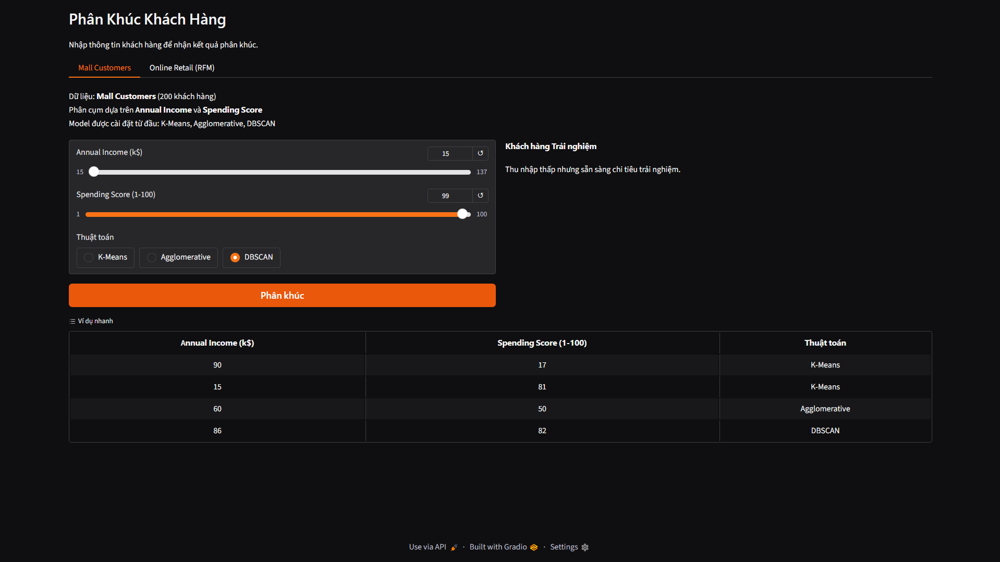
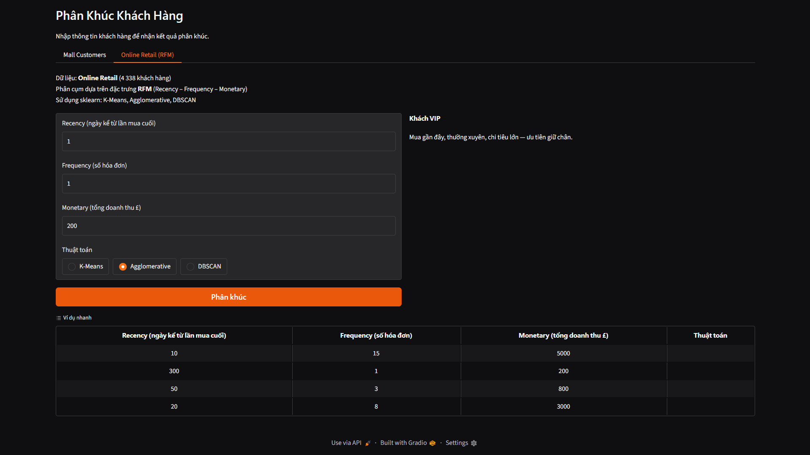

# Customer Segmentation — Phân Khúc Khách Hàng

> Phân tích và phân khúc khách hàng sử dụng **K-Means**, **DBSCAN** và **Agglomerative Hierarchical Clustering**, triển khai bằng NumPy, áp dụng trên hai bộ dữ liệu Mall Customer và Retail Online .


---

## Demo — Gradio Web App

Ứng dụng web tương tác cho phép nhập thông tin khách hàng và nhận kết quả phân khúc theo thời gian thực, hỗ trợ chuyển đổi giữa ba thuật toán.

```bash
pip install gradio
python app.py
```

### Tab 1 — Mall Customers

Nhập **Annual Income** và **Spending Score** qua slider, chọn thuật toán → nhận ngay tên phân khúc và mô tả chiến lược.


### Tab 2 — Online Retail (RFM)

Nhập ba chỉ số **Recency**, **Frequency**, **Monetary** của khách hàng, chọn thuật toán → phân loại vào phân khúc VIP / tiềm năng / rời bỏ kèm chiến lược kinh doanh tương ứng.



## Tổng quan dự án

Dự án này triển khai và so sánh ba thuật toán phân cụm phổ biến trong lĩnh vực Machine Learning nhằm giải quyết bài toán **phân khúc khách hàng (Customer Segmentation)** — một ứng dụng cốt lõi trong phân tích kinh doanh và marketing.

**Điểm nổi bật kỹ thuật:**
- Cài đặt **K-Means**, **DBSCAN**, **Agglomerative Hierarchical Clustering** từ đầu bằng NumPy thuần (không dùng sklearn để phân cụm) trên bộ dữ liệu Mall Customers
- Xây dựng pipeline **RFM (Recency–Frequency–Monetary)** hoàn chỉnh trên dữ liệu giao dịch thực tế (~541K dòng) với tiền xử lý, feature engineering và chuẩn hóa
- So sánh định lượng hiệu suất các thuật toán qua **Silhouette Score** và **Davies-Bouldin Index**
- Thiết kế hệ thống **đặt tên cụm tự động** dựa trên tọa độ tâm cụm và điểm tổng hợp RFM
- Cung cấp **chiến lược marketing** cụ thể cho từng phân khúc khách hàng

**Bộ dữ liệu:**
| Bộ dữ liệu | Quy mô | Đặc trưng | Mục tiêu |
|------------|--------|-----------|---------|
| Mall Customers | 200 khách hàng | Annual Income, Spending Score | Phân cụm 2D, kiểm chứng trực quan |
| Online Retail (UK) | ~542K giao dịch → 4,338 KH | RFM | Phân khúc hành vi mua sắm thực tế |

---

## Kiến trúc & Kỹ thuật

### Triển khai từ đầu (Mall Customers)

```
Input Data
    │
    ├─► EDA & Visualisation
    │
    ├─► KMeans (from scratch — NumPy)
    │       ├── Euclidean distance: np.linalg.norm
    │       ├── Centroid update: np.mean per cluster
    │       ├── Elbow Method: 2nd-order derivative of SSE
    │       └── k = 5 → Silhouette 0.5532
    │
    ├─► Agglomerative Hierarchical (from scratch — NumPy)
    │       ├── Ward linkage: minimise within-cluster variance
    │       ├── Dendrogram visualisation
    │       └── n = 5 → Silhouette 0.5530
    │
    └─► DBSCAN (from scratch — NumPy)
            ├── BFS cluster expansion
            ├── k-Distance graph → eps = 10
            └── 4 clusters + 10 noise points
```

### Pipeline RFM (Online Retail)

```
Raw Data (541,909 rows)
    │
    ├─► Tiền xử lý
    │       ├── Loại bỏ InvoiceNo bắt đầu bằng "C" (hủy đơn)
    │       ├── Loại UnitPrice ≤ 0, Quantity ≤ 0
    │       ├── Xử lý 24.9% giá trị null ở CustomerID
    │       └── 397,884 dòng → 4,338 khách hàng duy nhất
    │
    ├─► Feature Engineering (RFM)
    │       ├── Recency  = ngày kể từ lần mua cuối
    │       ├── Frequency = số hóa đơn duy nhất
    │       └── Monetary  = tổng doanh thu (£)
    │
    ├─► Chuẩn hóa theo thuật toán
    │       ├── X     : Log1p + StandardScaler   → EDA
    │       ├── X_mm  : MinMaxScaler             → K-Means, Agglomerative
    │       └── X_std : StandardScaler           → DBSCAN
    │
    └─► Phân cụm + Đánh giá + Đặt tên tự động
```

---

## Bộ dữ liệu

### Mall_Customers.csv

200 khách hàng, 5 thuộc tính, thu thập tại trung tâm thương mại.

| Cột | Kiểu | Mô tả |
|-----|------|-------|
| `CustomerID` | int | Mã định danh khách hàng |
| `Gender` | str | Giới tính (Male / Female) |
| `Age` | int | Tuổi |
| `Annual Income (k$)` | float | Thu nhập hàng năm (nghìn USD) |
| `Spending Score (1-100)` | int | Điểm chi tiêu tại trung tâm thương mại |

Phân cụm sử dụng hai đặc trưng `Annual Income` và `Spending Score`.

### Online Retail.xlsx

Dữ liệu giao dịch thực tế tại Anh, giai đoạn 12/2010 – 12/2011.

| Cột | Kiểu | Mô tả |
|-----|------|-------|
| `InvoiceNo` | str | Mã hóa đơn (`C` = hủy đơn) |
| `StockCode` | str | Mã sản phẩm |
| `Description` | str | Tên sản phẩm |
| `Quantity` | int | Số lượng |
| `InvoiceDate` | datetime | Ngày giờ hóa đơn |
| `UnitPrice` | float | Đơn giá (£) |
| `CustomerID` | float | Mã khách hàng (**24.9% null**) |
| `Country` | str | Quốc gia |

**Thống kê RFM sau tiền xử lý (4,338 KH):**

| Đặc trưng | Ý nghĩa | Mean | Max |
|-----------|---------|------|-----|
| **Recency (R)** | Số ngày kể từ lần mua cuối | 92.5 ngày | 374 ngày |
| **Frequency (F)** | Số hóa đơn duy nhất | 4.3 | 209 |
| **Monetary (M)** | Tổng doanh thu | £2,054 | £280,206 |

---

## Thuật toán

### K-Means

Triển khai từ đầu bằng NumPy. Quy trình:
1. Khởi tạo K tâm cụm ngẫu nhiên
2. Gán mỗi điểm vào tâm gần nhất (khoảng cách Euclidean)
3. Cập nhật tâm = trung bình các điểm trong cụm
4. Lặp đến hội tụ (`tol` ngưỡng dịch chuyển tâm)
5. Chọn k tối ưu qua **Elbow Method** (điểm gãy SSE — đạo hàm bậc 2 lớn nhất)

### Agglomerative Hierarchical Clustering

Triển khai từ đầu theo hướng **Bottom-up**:
1. Ban đầu: mỗi điểm là một cụm riêng biệt
2. Gộp lặp đại cặp cụm có khoảng cách nhỏ nhất (Ward linkage)
3. Ward linkage: tối thiểu hóa gia tăng phương sai nội cụm khi gộp
4. Hỗ trợ 4 linkage: `ward`, `single`, `complete`, `average`
5. Trực quan hóa bằng **Dendrogram** để chọn ngưỡng cắt

### DBSCAN

Triển khai từ đầu, dựa trên mật độ:
1. Xác định **core point**: điểm có ≥ `min_samples` láng giềng trong bán kính `eps`
2. Mở rộng cụm từ core point bằng BFS
3. Điểm không thuộc cụm nào → **noise** (nhãn `-1`)
4. Chọn `eps` qua **k-distance graph** (điểm khuỷu tay — knee point)

---

## Đặt tên cụm tự động

### Mall Customers — dựa trên tọa độ tâm cụm

So sánh tâm cụm với **median toàn bộ dữ liệu**:
> Median Income ≈ 61.5 k$ · Median Spending Score ≈ 50

| Phân khúc | Điều kiện | Ý nghĩa kinh doanh |
|-----------|-----------|-------------------|
| **Khách hàng Cao cấp** | Income ≥ 61.5 **và** Score ≥ 50 | Nhóm VIP — mục tiêu ưu tiên |
| **Khách hàng Thận trọng** | Income ≥ 61.5 **và** Score < 50 | Thu nhập cao, chi tiêu có chọn lọc |
| **Khách hàng Trải nghiệm** | Income < 61.5 **và** Score ≥ 50 | Sẵn sàng chi tiêu dù thu nhập thấp |
| **Khách hàng Phổ thông** | Income < 61.5 **và** Score < 50 | Hạn chế tài chính, chi tiêu cẩn trọng |
| **Khách hàng Ổn định** | \|Income − 61.5\| < 18 **và** \|Score − 50\| < 18 | Trung lưu, hành vi cân bằng |
| **Điểm ngoại lai** (DBSCAN) | nhãn −1 | Hành vi bất thường — phân tích riêng |

### Online Retail — điểm tổng hợp RFM

```
RFM_Score = −norm(Recency) + norm(Frequency) + norm(Monetary)
```

- `norm(x)` = Min-Max normalization về [0, 1]
- Recency **thấp** → mua gần đây → đóng góp **dương**
- Frequency và Monetary **cao** → đóng góp **dương**
- Cụm có score cao nhất → tên tốt nhất

| Hạng RFM Score | Tên (3 cụm) | Tên (2 cụm) |
|----------------|-------------|-------------|
| 1 — cao nhất | **Khách VIP** | **Khách hoạt động** |
| 2 | **Khách tiềm năng** | **Khách ít hoạt động** |
| 3 — thấp nhất | **Khách rời bỏ** | — |

---

## Chiến lược marketing theo phân khúc

| Phân khúc | Recency | Frequency | Monetary | Chiến lược đề xuất |
|-----------|---------|-----------|----------|--------------------|
| **Khách VIP** | Thấp | Cao | Cao | Loyalty program, ưu đãi độc quyền, chăm sóc ưu tiên |
| **Khách tiềm năng** | Thấp | Trung bình | Trung bình | Welcome offer, gợi ý sản phẩm cá nhân hóa, nurturing |
| **Khách rời bỏ** | Cao | Thấp | Thấp | Win-back campaign — hoặc chấp nhận mất (ROI thấp) |
| **Ngoại lệ** (DBSCAN) | — | — | — | Phân tích riêng lẻ, phát hiện gian lận / hành vi đặc biệt |

---

## Kết quả thực nghiệm

### Mall Customers

#### K-Means (k = 5)

Chọn k = 5 qua Elbow Method + Silhouette Score trên đặc trưng `Annual Income × Spending Score`.

| Cụm | Income TB (k$) | Score TB | Số KH | Phân khúc |
|-----|---------------|----------|-------|-----------|
| 0 | ~55 | ~50 | 80 | Khách hàng Ổn định |
| 1 | ~26 | ~79 | 22 | Khách hàng Trải nghiệm |
| 2 | ~26 | ~21 | 23 | Khách hàng Phổ thông |
| 3 | ~87 | ~82 | 39 | Khách hàng Cao cấp |
| 4 | ~88 | ~18 | 36 | Khách hàng Thận trọng |

> **Silhouette Score: 0.5532** · Davies-Bouldin Index: 0.5711

#### Agglomerative Hierarchical (Ward, n = 5)

Dendrogram gợi ý ngưỡng cắt tại khoảng cách ≈ 120 → 5 cụm.

| Phân khúc | Đặc điểm |
|-----------|----------|
| Khách hàng Cao cấp | Income cao, Score cao |
| Khách hàng Thận trọng | Income cao, Score thấp |
| Khách hàng Trải nghiệm | Income thấp, Score cao |
| Khách hàng Phổ thông | Income thấp, Score thấp |
| Khách hàng Ổn định | Income & Score trung bình |

> **Silhouette Score: 0.5530** · Davies-Bouldin Index: 0.5782

#### DBSCAN (eps = 10, min_samples = 3)

`eps = 10` xác định từ điểm khuỷu tay trên k-distance graph (k = 3).

| Phân khúc | Số KH | Ghi chú |
|-----------|-------|---------|
| Khách hàng Ổn định | 126 | Cụm mật độ cao nhất |
| Khách hàng Cao cấp | 33 | Income cao, Score cao |
| Khách hàng Thận trọng | 28 | Income cao, Score thấp |
| Khách hàng Trải nghiệm | 3 | Income thấp, Score rất cao |
| **Điểm ngoại lai** | **10** | Không thuộc cụm nào |

> DBSCAN tìm được **4 cụm** (không tách riêng được Phổ thông) + 10 điểm nhiễu

#### So sánh — Mall Customers

| Thuật toán | Số cụm | Silhouette ↑ | Davies-Bouldin ↓ | Nhiễu |
|------------|--------|-------------|-----------------|-------|
| **K-Means** | 5 | **0.5532** | **0.5711** | 0 |
| **Agglomerative** | 5 | 0.5530 | 0.5782 | 0 |
| **DBSCAN** | 4 | 0.3951 | 0.6016 | 10 |

---

### Online Retail (RFM)

#### Cấu hình tham số

| Thuật toán | Tham số | Giá trị | Cách chọn |
|------------|---------|---------|-----------|
| **K-Means** | `n_clusters` | tự động | Elbow — đạo hàm bậc 2 SSE (k = 2..10) |
| | `init` | `k-means++` | Giảm nguy cơ hội tụ cục bộ |
| | `n_init` | 10 | Giữ kết quả SSE tốt nhất trong 10 lần |
| | `random_state` | 42 | Cố định seed để tái tạo kết quả |
| **Agglomerative** | `linkage` | `ward` | Tối thiểu hóa tăng phương sai nội cụm |
| | `metric` | `euclidean` | Khoảng cách Euclidean |
| **DBSCAN** | `eps` | 0.3 | K-distance graph (k = 5) + thực nghiệm theo bài báo |
| | `min_samples` | 5 | Số điểm tối thiểu để tạo core point |

#### K-Means — 3 cụm (tự động chọn qua Elbow)

| Phân khúc | Recency | Frequency | Monetary |
|-----------|---------|-----------|----------|
| **Khách VIP** | Thấp nhất | Cao nhất | Cao nhất |
| **Khách tiềm năng** | Thấp | Trung bình | Trung bình |
| **Khách rời bỏ** | Cao nhất | Thấp nhất | Thấp nhất |

#### DBSCAN — 2 cụm + 107 ngoại lệ

- Grid search `eps` từ 0.1 → 1.0 để xác định `eps = 0.3` tối ưu
- Kết quả: **Khách hoạt động** và **Khách ít hoạt động** + 107 điểm ngoại lệ

#### So sánh — Online Retail

| Thuật toán | Chuẩn hóa | Số cụm | Silhouette ↑ | Davies-Bouldin ↓ | Nhiễu |
|------------|-----------|--------|-------------|-----------------|-------|
| **K-Means** | MinMaxScaler | 3 | **0.6448** | **0.5051** | 0 |
| **Agglomerative** | MinMaxScaler | 3 | 0.5537 | 0.5905 | 0 |
| **DBSCAN** | StandardScaler | 2 | 0.6447 | 2.5281 | 107 |

> Phương pháp tham chiếu: *John et al., "An Exploration of Clustering Algorithms for Customer Segmentation in the UK Retail Market", Analytics 2023*

---

## So sánh thuật toán

| | K-Means | Agglomerative | DBSCAN |
|---|---------|---------------|--------|
| **Cần biết K trước** | Có | Có (hoặc dùng dendrogram) | Không |
| **Phát hiện nhiễu** | Không | Không | Có |
| **Độ phức tạp** | O(n·k·iter) | O(n² log n) | O(n log n) |
| **Hình dạng cụm** | Cầu | Phụ thuộc linkage | Tùy ý |
| **Nhạy cảm với outlier** | Có | Có | Không |
| **Phù hợp Mall Customers** | ✅ Tốt nhất | ✅ Tốt | ⚠️ Chấp nhận |
| **Phù hợp Online Retail** | ✅ Tốt nhất | ✅ Tốt | ⚠️ DBI cao |

**Nhận xét:** K-Means cho kết quả tốt nhất trên cả hai bộ dữ liệu xét về Silhouette Score và Davies-Bouldin Index. DBSCAN có ưu thế duy nhất là phát hiện điểm bất thường (noise), phù hợp cho bài toán phát hiện gian lận.

---

## Cấu trúc dự án

```
Customer_Classification/
├── Mall_Customer_segmentation.ipynb          ← Cài đặt từ đầu (NumPy)
├── online_retail_1_classification.ipynb      ← RFM Pipeline (sklearn)
├── online_retail_2_classification.ipynb      ← Phân tích bổ sung
├── Mall_Customers.csv                        ← Dataset 1
├── Online Retail.xlsx                        ← Dataset 2
└── README.md
```

### Mall_Customer_segmentation.ipynb — Cấu trúc chi tiết

```
├── 1. Import thư viện
├── 2. EDA (Exploratory Data Analysis)
├── 3. Hàm tiện ích (euclidean_distance, pairwise_distances, evaluate, plot_clusters)
├── K-Means (from scratch)
│   ├── Class KMeans — NumPy
│   ├── Elbow Method & Silhouette (k = 2..10)
│   ├── Kết quả k = 5 + vẽ tâm cụm
│   └── Bảng phân khúc + tiêu chí đặt tên
├── Agglomerative Hierarchical (from scratch)
│   ├── Class Agglomerative — NumPy, Ward linkage
│   ├── Kết quả n = 5 + Dendrogram
│   └── Bảng phân khúc + tiêu chí đặt tên
├── DBSCAN (from scratch)
│   ├── Class DBSCAN — NumPy, BFS
│   ├── k-distance graph (chọn eps = 10)
│   ├── Kết quả eps = 10, min_samples = 3
│   └── Bảng phân khúc + tiêu chí đặt tên
├── So sánh 3 thuật toán + Kết luận
└── Biểu đồ 2D các cặp đặc trưng
```

### online_retail_1_classification.ipynb — Cấu trúc chi tiết

```
├── 1. Nhập thư viện
├── 2. Tải & khám phá dữ liệu thô (541,909 dòng)
├── 3. Tiền xử lý + Feature Engineering RFM (4,338 KH)
├── 4. Chuẩn hóa
│   ├── X    — Log1p + StandardScaler (EDA)
│   ├── X_mm — MinMaxScaler (K-Means, Agglomerative)
│   └── X_std — StandardScaler (DBSCAN)
├── 5. EDA Visualization
│   ├── Phân phối RFM (trước & sau xử lý)
│   ├── Boxplot phát hiện ngoại lệ
│   ├── Scatter plot các cặp RFM
│   ├── Ma trận tương quan
│   ├── Top 10 quốc gia theo doanh thu
│   └── Doanh thu theo tháng
├── 6. Hàm đánh giá (auto_name_clusters, plot_elbow_silhouette, ...)
├── 7. K-Means
│   ├── Elbow Method (SSE, k = 2..10)
│   ├── Chọn K tự động — đạo hàm bậc 2 SSE
│   ├── Silhouette plot + PCA 2D
│   └── Bảng phân khúc + chiến lược kinh doanh
├── 8. Agglomerative Hierarchical (Ward)
│   ├── Dendrogram (mẫu 300 KH)
│   ├── Chọn K tự động — đạo hàm bậc 2 SSE
│   └── Silhouette plot + phân tích RFM
├── 9. DBSCAN
│   ├── K-Distance Graph (eps gợi ý = 0.3)
│   ├── Grid search eps (0.1 → 1.0)
│   ├── Huấn luyện eps = 0.3, min_samples = 5
│   └── Silhouette plot + phân tích RFM
├── 10. So sánh 3 thuật toán (Silhouette + Davies-Bouldin)
├── 11. Phân tích phân khúc chi tiết + chiến lược
├── 12. Kết luận
└── 13. Scatter plot 2D từng cặp RFM (K-Means / Agglomerative / DBSCAN)
```

---

## Đánh giá mô hình

| Chỉ số | Ý nghĩa | Tốt khi |
|--------|---------|---------|
| **Silhouette Score** | Đo độ gắn kết nội cụm và tách biệt liên cụm. Giá trị gần 1: cụm rõ ràng | Gần **+1** |
| **Davies-Bouldin Index** | Tỉ lệ phân tán trong cụm so với khoảng cách giữa cụm | Gần **0** |

Cả hai chỉ số đều là **unsupervised metrics** — không cần nhãn thật để đánh giá, phù hợp cho bài toán phân cụm thực tế.

---

## Cài đặt & Sử dụng

### Yêu cầu

```
numpy
pandas
matplotlib
seaborn
scikit-learn
scipy
openpyxl
```

```bash
pip install numpy pandas matplotlib seaborn scikit-learn scipy openpyxl
```

### Chạy notebook

```bash
# Mall Customers — triển khai từ đầu (NumPy)
jupyter notebook Mall_Customer_segmentation.ipynb

# Online Retail — pipeline RFM + sklearn
jupyter notebook online_retail_1_classification.ipynb
```

---

## Kỹ năng & Công nghệ

| Hạng mục | Chi tiết |
|----------|----------|
| **Ngôn ngữ** | Python 3.9+ |
| **Cài đặt từ đầu** | K-Means, DBSCAN, Agglomerative Hierarchical (NumPy thuần) |
| **Thư viện ML** | scikit-learn (đánh giá, chuẩn hóa), scipy (dendrogram) |
| **Xử lý dữ liệu** | pandas (tiền xử lý, RFM engineering), numpy |
| **Trực quan hóa** | matplotlib, seaborn (EDA, cluster plots, dendrogram, heatmap) |
| **Kỹ thuật chọn siêu tham số** | Elbow Method, k-Distance Graph, Grid Search |
| **Đánh giá mô hình** | Silhouette Score, Davies-Bouldin Index |
| **Feature Engineering** | RFM (Recency, Frequency, Monetary) |
| **Chuẩn hóa** | MinMaxScaler, StandardScaler, Log1p transform |
| **Môi trường** | Jupyter Notebook |
